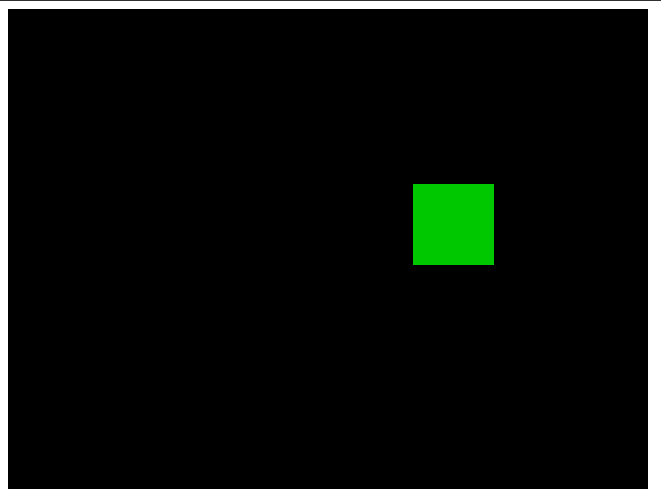

# browser-raycast

A browser game where a Go server bridges a WebSocket frontend and a Python
rendering backend. The Go side manages sessions and timing; Python owns the game
state and produces frames.

---

## Architecture

```
┌─────────────────────────────────────────────────────────┐
│  Browser (index.html)                                   │
│                                                         │
│  keydown/keyup → inputState{}  ──────► ws.send() 20Hz  │
│                                                         │
│  ws.onmessage ──► createImageBitmap ──► canvas          │
└───────────────────────┬─────────────────────────────────┘
                        │  WebSocket  (port 8080)
                        │  JSON key state  ▼
                        │  PNG frames      ▲
┌───────────────────────┴─────────────────────────────────┐
│  Go server                                              │
│                                                         │
│  handleWS()                                             │
│    └── Session                                          │
│          ├── readWS()  [goroutine]                      │
│          │     reads JSON from WS → updates input map   │
│          │     on disconnect → closes done channel      │
│          │                                              │
│          └── tickLoop()  [main goroutine]               │
│                fires every 50ms                         │
│                snapshots input → SendInput → recv PNG   │
│                sends PNG to browser via WS              │
│                on done / error → Cleanup()              │
└───────────────────────┬─────────────────────────────────┘
                        │  TCP  (port 9000)
                        │  length-prefixed frames
                        │  JSON input  ▼
                        │  PNG frame   ▲
┌───────────────────────┴─────────────────────────────────┐
│  Python renderer  (renderer/render.py)                  │
│                                                         │
│  accept loop                                            │
│    └── handle_client()                                  │
│          recv JSON → update(state) → render() → PNG     │
│          send PNG back                                  │
│          on EOF → break → wait for next connection      │
└─────────────────────────────────────────────────────────┘
```

---



---

## Concepts used

### WebSocket
Persistent full-duplex connection between browser and Go server, over HTTP
upgrade. Used here for two separate data streams on one connection: JSON key
state going in, binary PNG frames coming out. The browser sets `binaryType =
"blob"` so received frames can be fed directly to `createImageBitmap`.

### TCP with length-prefixed framing
Raw TCP has no concept of messages — it's a byte stream. To send structured
messages, every payload is prefixed with a 4-byte big-endian length. The
receiver reads the header first, then reads exactly that many bytes. This is
implemented symmetrically in `protocol.go` and `protocol.py`. `io.ReadFull` /
`recv_exact` ensure partial reads are handled correctly.

### Goroutines and channels
Each browser session spawns two goroutines worth of work:
- `readWS` runs as a goroutine — blocks on WS reads, writes input state
- `tickLoop` runs on the handler goroutine — drives the render clock

Shutdown coordination uses a `done chan struct{}`: `readWS` closes it on
disconnect, `tickLoop` selects on it to exit cleanly. This is idiomatic Go for
one-time signals between goroutines.

### Mutex / shared state
`readWS` and `tickLoop` run concurrently and both touch `input`. A
`sync.RWMutex` protects it: `readWS` takes a write lock when merging new keys,
`tickLoop` takes a read lock to snapshot before each render tick. `tickLoop` is
the sole writer to the WebSocket connection (noted in a comment), avoiding the
need to lock writes.

### Decoupled tick rate vs. input rate
The browser sends input at 20Hz. The renderer ticks at 20Hz (50ms). These are
intentionally independent: input arrives asynchronously and is merged into a
shared map; the ticker snapshots whatever is current. This avoids coupling the
render clock to network jitter.

### Request-response over TCP
The Go↔Python protocol is synchronous request/response per tick: send JSON
input, block until PNG comes back. Simple and sufficient for a single-session
game — no pipelining needed.

### Python as a rendering subprocess
Python owns `GameState` and `Renderer`. It uses Pillow to draw to an in-memory
image, encodes it as PNG, and sends the bytes over TCP. This keeps game logic
and rendering in Python while Go handles all the networking.

---

## File map

| File | What it does |
|---|---|
| `main.go` | HTTP server, WebSocket upgrade, session construction |
| `session.go` | `Session` type: `readWS` goroutine + `tickLoop`, lifecycle management |
| `python.go` | `PythonClient`: TCP connection to renderer, `SendInput` |
| `protocol.go` | Low-level framing: `sendFrame`, `recvBinary`, `recvExact` |
| `static/index.html` | Browser: key capture, WS send loop, canvas rendering |
| `renderer/render.py` | Python TCP server: game state, update loop, Pillow rendering |
| `renderer/protocol.py` | Python mirror of the framing protocol |
