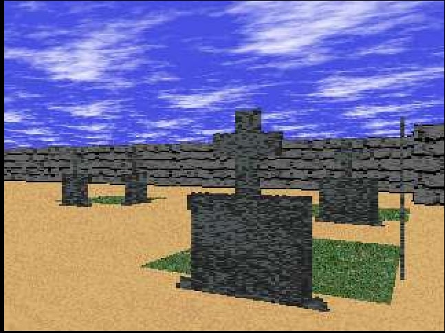

# browser-raycast

A multiplayer browser game. A single Go server owns everything: sessions,
auth, timing, game state and the raycasting renderer (the `game/` package).
PostgreSQL stores users and sessions.

---

## Architecture

```
┌─────────────────────────────────────────────────────────┐
│  Browser                                                │
│                                                         │
│  index.html  — login / register / avatar upload         │
│  game.html   — gameplay canvas                          │
│                                                         │
│  keydown/keyup → inputState{}  ──────► ws.send() 20Hz  │
│  ws.onmessage ──► createImageBitmap ──► canvas          │
└───────────────────────┬─────────────────────────────────┘
                        │  HTTP (auth API + static files)
                        │  WebSocket  (port 8080)
                        │  JSON key state  ▼
                        │  JPEG frames     ▲
┌───────────────────────┴─────────────────────────────────┐
│  Go server                                              │
│                                                         │
│  auth.go — register/login/logout, bcrypt, sessions      │
│  main.go — HTTP routing, WS upgrade, session guard      │
│                                                         │
│  handleWS()                                             │
│    └── Session                                          │
│          ├── readWS()  [goroutine]                      │
│          │     reads JSON from WS → updates input map   │
│          │     on disconnect → closes done channel      │
│          │                                              │
│          └── tickLoop()  [main goroutine]               │
│                fires every 100ms                        │
│                snapshots input → engine.Tick()          │
│                sends JPEG to browser via WS             │
│                on done / error → Cleanup()              │
│                                                         │
│  game/ — shared world + per-player state                │
│    Step()   input → movement/collision  [write lock]    │
│    Render() DDA raycasting → JPEG       [read lock]     │
└───────────────────────────────┬─────────────────────────┘
                                │  postgres (port 5432)
                                │  users, sessions
                  ┌─────────────┴───────────────┐
                  │  PostgreSQL                  │
                  │                              │
                  │  users  — bcrypt passwords,  │
                  │           avatar blobs        │
                  │  sessions — token → user_id  │
                  └──────────────────────────────┘
```

---



---

## Running

The stack runs as two containers (server + Postgres). Copy the example env,
then bring it up:

```bash
cp .env.example .env   # fill in POSTGRES_USER, POSTGRES_PASSWORD, POSTGRES_DB
docker compose up --build
```

Open `http://localhost:8080`. Register an account, upload an optional avatar,
then click **join game**.

`run.sh` (bare `go run .`) still works for local dev but requires a local
Postgres instance reachable at the default `DATABASE_URL`.

### Production

`docker-compose.prod.yml` extends the base compose file for deployment — it
pulls pre-built images from GHCR and binds the backend only to localhost so a
reverse proxy (nginx, Caddy, etc.) can front it:

```bash
docker compose -f docker-compose.yml -f docker-compose.prod.yml up -d
```

---

## Auth API

All endpoints return JSON. The WebSocket at `/ws` requires a valid session
cookie — unauthenticated connections are rejected with 401.

| Method | Path | Description |
|--------|------|-------------|
| POST | `/register` | Create account `{username, password}` |
| POST | `/login` | Authenticate, set `session_token` cookie |
| POST | `/logout` | Invalidate session, close any active WS |
| POST | `/unregister` | Delete account (requires password confirmation) |
| GET | `/me` | Returns current username if logged in |
| GET | `/avatar` | Fetch current user's avatar image |
| POST | `/avatar/upload` | Upload PNG or GIF avatar (5 MB max) |

---

## Concepts used

### WebSocket
Persistent full-duplex connection between browser and Go server, over HTTP
upgrade. Used here for two separate data streams on one connection: JSON key
state going in, binary JPEG frames coming out. The browser sets `binaryType =
"blob"` so received frames can be fed directly to `createImageBitmap`.

### Goroutines and channels
Each browser session spawns two goroutines worth of work:
- `readWS` runs as a goroutine — blocks on WS reads, writes input state
- `tickLoop` runs on the handler goroutine — drives the render clock

Shutdown coordination uses a `done chan struct{}`: `readWS` closes it on
disconnect, `tickLoop` selects on it to exit cleanly. This is idiomatic Go for
one-time signals between goroutines.

### Mutex / shared state
`readWS` and `tickLoop` run concurrently and both touch `input`. A
`sync.RWMutex` protects it: `readWS` takes a write lock when merging new keys,
`tickLoop` takes a read lock to snapshot before each render tick. `tickLoop` is
the sole writer to the WebSocket connection, avoiding the need to lock writes.

### Decoupled tick rate vs. input rate
The browser sends input at 20Hz. The renderer ticks at 10Hz (100ms). These are
intentionally independent: input arrives asynchronously and is merged into a
shared map; the ticker snapshots whatever is current. This avoids coupling the
render clock to network jitter.

### Session-cookie auth
Login issues an `HttpOnly` `session_token` cookie backed by a Postgres
`sessions` table. The WebSocket handler and all protected endpoints look up the
session on every request. Logout deletes the DB row and closes any open WS
connection for that user.

### In-process rendering with a shared world
The `game/` package owns the world and every player. One `sync.RWMutex` covers
both: an input step mutates state under the write lock, rendering only reads
under the read lock, so concurrent sessions render in parallel. Rendering is
DDA raycasting (walls), per-pixel floor/ceiling casting, billboard sprites and
stdlib `image/jpeg` encoding.

---

## File map

| File | What it does |
|---|---|
| `main.go` | HTTP routing, WebSocket upgrade, session guard |
| `auth.go` | Register/login/logout handlers, bcrypt, Postgres helpers |
| `session.go` | `Session` type: `readWS` goroutine + `tickLoop`, lifecycle |
| `game/world.go` | `Engine`: shared world, players, locking, `Tick` |
| `game/mapload.go` | Tile map loader (`TILES.csv`/`map.csv` + `definitions.csv`) |
| `game/update.go` | Per-tick input: movement, collision, doors, portals |
| `game/dda.go` | DDA raycasting through the tile grid |
| `game/fov.go` | Fires 120 rays across the 60° FOV |
| `game/render.go` | Floor/ceiling casting, wall panes, sprites, minimap, JPEG |
| `game/texture.go` | Texture loading (PNG/GIF) and sampling |
| `db/schema.sql` | Postgres schema: `users`, `sessions` tables |
| `static/index.html` | Login/register page + avatar management |
| `static/game.html` | Gameplay canvas: key capture, WS loop, frame rendering |
| `Dockerfile.backend` | Go server image (bundles map, definitions, textures) |
| `docker-compose.yml` | Local dev: server + Postgres + Caddy |
| `docker-compose.prod.yml` | Production overlay: GHCR images, restart policies |
