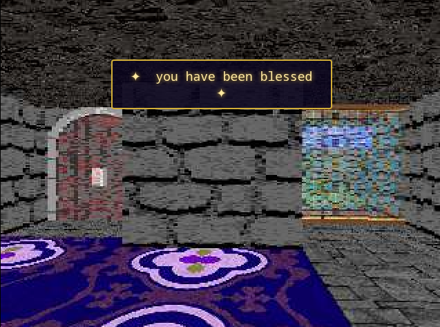

# scripts/

Drop a `.js` file in this folder and the map starts doing things. No engine
code, no rebuild, no restart — the server watches this folder and **hot
reloads within a second** of any change. Break something? The error lands in
the server log and the game keeps running.

Scripts are JavaScript, executed server-side by an embedded interpreter
([goja](https://github.com/dop251/goja)). They register handlers at load time
and then wait; the engine calls them at the right moments.

```js
// splash.js — the whole thing
onEnter("0204", ctx => {          // any water tile (id from definitions.csv)
    ctx.tone(180, 300, 0.4, 0);   // blub
});
```

`blessed.js` in this folder is the reference example.



## ELI5: how do events work?

The game is a clock that ticks 10 times a second. On every tick, for every
player, the engine asks: **did this player just step into a new cell?**
(`onEnter`), **did they press space looking at something?** (`onUse`), **is a
recurring job due?** (`onTick`). Your script is a stack of sticky notes you
hand the engine — *"when someone steps on the pond, play a splash"* — and the
engine reads the right note at the right moment.

A sound, in turn, is just a message to the browser: the server never sends
audio, it sends *"play M0002, fade over 1.5s"*, and the browser — which
fetches tracks from `/ost/` on demand — does the playing. Same for popups.
One WebSocket carries everything: binary frames are video, text frames are
these little JSON events.

## Registering handlers

| call | fires when |
|------|-----------|
| `onEnter(spec, fn)` | a player's cell changes to a matching cell |
| `onUse(spec, fn)` | a player presses space while looking at a matching cell (sampled a few tiles deep, same as doors) |
| `onJoin(fn)` | a player connects and spawns |
| `onTick(every, fn)` | every `every` ticks (1 tick = 100 ms), once globally — not per player |

`spec` is either a **tile ID string** from `definitions.csv` (`"0003"` fires
on every trigger tile on the map — both its wall and floor layer are checked)
or a **specific cell**: `[col, row]` or `{col: 41, row: 12}`. Register as
many handlers as you like; they run in registration order.

`log("...")` prints to the server log from anywhere.

## The ctx object

Every handler gets one argument. `ctx.player` is the triggering player
(`null` in `onTick`), `ctx.col`/`ctx.row` the triggering cell (`-1` in
`onTick`/`onJoin` has the spawn cell).

**Messages to browsers**

| member | effect |
|--------|--------|
| `ctx.popup(text, ms)` | on-screen message; `ms` 0 → 3000. `ctx.popupAll(...)` for everyone |
| `ctx.tone(freq, ms, vol, delayMs)` | synthesized note, zero assets needed; stack delays to build melodies. `ctx.toneAll(...)` |
| `ctx.sound(file, vol)` | one-shot audio file — bare names resolve to `/ost/<name>`. `ctx.soundAll(...)` |
| `ctx.music(id)` | pin this player's soundtrack to a zone ID (overrides MUSIC.csv) |
| `ctx.musicAuto()` | give control back to MUSIC.csv zones |
| `ctx.js(code)` | run arbitrary JavaScript in the player's browser. Really. `ctx.jsAll(...)` |
| `ctx.send({type:"...", ...})` / `ctx.sendTo(player, {...})` | raw JSON event — invent your own type and add a handler to `HANDLERS` in `static/game.html` |

**World mutation** (global — every player sees it, instantly)

| member | effect |
|--------|--------|
| `ctx.setWall(col, row, id)` | rewrite a cell's wall layer through definitions.csv — `"0000"` opens a hole, `"0100"` walls someone in |
| `ctx.setFloor(col, row, id)` / `ctx.setCeiling(...)` | same for the other layers |
| `ctx.cell(col, row)` | the **live** cell object — assign to `.walkable`, `.textureName`, `.wall`, ... to bypass definitions entirely |
| `ctx.teleport(player, col, row)` | drop a player at a cell center; fractions work, walls are not checked |

**Queries**

| member | effect |
|--------|--------|
| `ctx.players()` | every connected player — live, writable objects |
| `ctx.map()` | the current map (grid, cols, rows, ...) |
| `ctx.log(...)` | server log with `[script]` prefix |

`ctx.player` itself is live and writable: `x`, `y` (world px, 64 per tile),
`angle` (radians), `name`, `id`, `showMap`, `currentMap`. Yes, you can just
assign to them.

## State

Top-level `let`/`const` in your script persist between handler calls — that's
your per-script memory (see `lastBlessed` in `blessed.js`). It is wiped on
every hot reload and server restart. If you need durability, you're at the
point where you should talk to the engine code.

Handlers run under the engine's write lock: no races with movement or other
scripts, but also **keep them fast** — you're inside the 100 ms tick. No
sleeping, no I/O. goja gives you plain ES6-ish JavaScript: no `fetch`, no
`setTimeout`, no Node APIs — the world is your API.

## On safety (there is none)

This is not a sandbox and that is the point. Scripts are repo code, deployed
with the container, same trust level as `main.go`. The API hands you live
pointers and asks no questions, which is exactly what makes the fun stuff
possible:

- `ctx.player.x = -5000` — yeet yourself into the void. Rendering may panic;
  the server survives and just drops that player's session (they can rejoin).
- `ctx.cell(c, r).walkable = true` on a wall — noclip zone.
- `ctx.cell(c, r).textureName = "water"` — walls of water, why not.
- `ctx.js("document.body.style.filter='invert(1)'")` — curse a player's
  browser.
- `onTick(1, ...)` that rewrites the map every 100 ms — animated architecture.

The engine promises exactly one thing: a script that throws, or even panics
the renderer, is logged and **never brings the server down**. Everything else
is your problem, glorious or otherwise.

## Music zones (how the soundtrack picks itself)

Music is data, not scripting: `MUSIC.csv` is a grid parallel to `TILES.csv`
where each cell holds a zone ID (`M0001`, `M0002`, ...). Stand in a zone for
~300 ms (hysteresis, so hugging a boundary doesn't stutter) and the browser
crossfades to that zone's track. `M0000` is silence. `MUSIC_DEFS.csv` maps
zone IDs to files and tuning (`id,file,loop,volume,fade_ms`); IDs without a
row fall back to `/ost/<id>.wav`, looping, full volume. Tracks live in
`/ost/` — MP3/OGG/WAV all fine (whatever the browser can decode; plain PCM
WAV yes, ADPCM no).

Scripts override zones per player with `ctx.music("M0006")` and hand control
back with `ctx.musicAuto()`.

## Cookbook

```js
// a door that only opens for one chosen player (the secret-key idea)
onUse([53, 4], ctx => {
    if (ctx.player.name === "kosmolit_fan") {
        ctx.setWall(53, 4, "0000");
        ctx.tone(80, 800, 0.6, 0);            // rumble
        ctx.popup("the church accepts you");
    } else {
        ctx.popup("it doesn't budge");
    }
});

// day/night: swap every daysky ceiling for nightsky each in-game "hour"
let night = false;
onTick(600, ctx => {                          // every 60 s
    night = !night;
    const m = ctx.map(), id = night ? "0213" : "0212";
    for (let r = 0; r < m.rows; r++)
        for (let c = 0; c < m.cols; c++)
            if (ctx.cell(c, r).ceilingID === "0212" || ctx.cell(c, r).ceilingID === "0213")
                ctx.setCeiling(c, r, id);
});

// custom client behavior without a custom event type
onEnter("0302", ctx => {                      // lava
    ctx.js("document.getElementById('screen').style.boxShadow='0 0 80px red'");
});
```

To add a **new event type** instead of riding `eval`: `ctx.send({type:
"shake", ms: 500})` here, and in `static/game.html` add `shake: ev => {...}`
to the `HANDLERS` table. Unknown types are silently ignored, so you can ship
the script before the client handler or vice versa.
